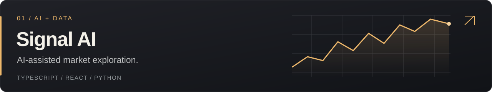

  <a href="https://sharan-portfolio-tan.vercel.app"><strong>Explore my portfolio ↗</strong></a>
  &nbsp;&nbsp; / &nbsp;&nbsp;
  <a href="https://www.linkedin.com/in/sharanaharry2">LinkedIn</a>
  &nbsp;&nbsp; / &nbsp;&nbsp;
  <a href="mailto:sharansharry678@gmail.com">Say hello</a>

### A little about me

I'm **Sharan**, a Computer Science Engineering graduate who enjoys turning ideas into things you can use. My work brings together **AI, data visualization, and web development** — from building Signal AI with Python and React to crafting thoughtful interfaces.

I care about how a product works **and** how it feels. This is my workshop for both.

## Selected work

An application for exploring stock data, technical indicators, and AI-assisted analysis, with a React interface and a Python API.

**The project** · TypeScript · React · FastAPI · Python
 
**[Live demo ↗](https://stellar-signal-ai.vercel.app)** · [Explore Signal AI](https://github.com/sharan7860/signal-ai)

 

My personal website: a home for my projects, with a dark visual style, responsive layouts, and animated interactions.

**Built with** · React · Vite · Framer Motion · GSAP
 
**[Live portfolio ↗](https://sharan-portfolio-tan.vercel.app)** · [Explore the code](https://github.com/sharan7860/Sharan-Portfolio)

## My toolkit

| What I'm building | Tools I reach for |
| :--- | :--- |
| Web experiences | TypeScript, JavaScript, React, HTML, CSS |
| APIs & applications | Python, FastAPI, Node.js, Git |
| Data & ML experiments | pandas, NumPy, TensorFlow, statsmodels |
| Visuals & interaction | Plotly, Matplotlib, Framer Motion, GSAP |

### On my workbench

- **Building:** Signal AI — an AI-assisted market exploration experience.
- **Exploring:** deep learning, LLM applications, and bringing models into web products.
- **Practicing:** deployment, system design, and thoughtful interaction details.

---

**Have an idea worth building? [Let's talk ↗](mailto:sharansharry678@gmail.com)**

[Portfolio](https://sharan-portfolio-tan.vercel.app) · [LinkedIn](https://www.linkedin.com/in/sharanaharry2) · [YouTube](https://www.youtube.com/@MysterBlankYT) · [More projects](https://github.com/sharan7860?tab=repositories)

Curiosity → experiments → things that work.
